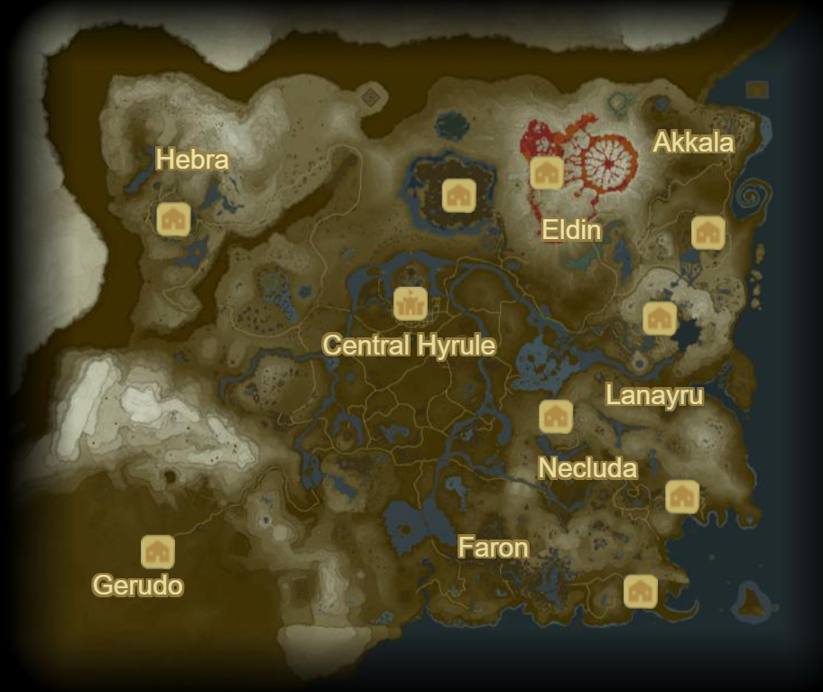

# zelda-map-nsi
Search the shorter distance between 2 points of the BOTW map, passing by as many places as you want, with a graphical interface.
It now handles two algorythmes to work, so that you can see the difference between a fast, but unprecise one, and another, that is slow but precise.

Below is the map we utilise to make this project :

_made by Simon Lancelin and Shingis Jelen_
